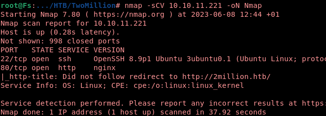
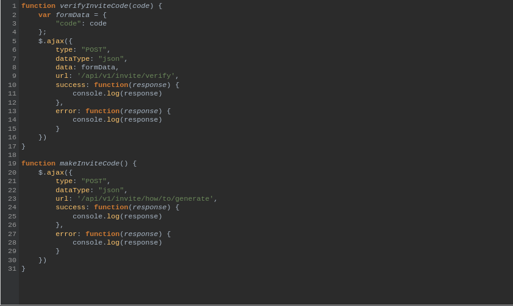
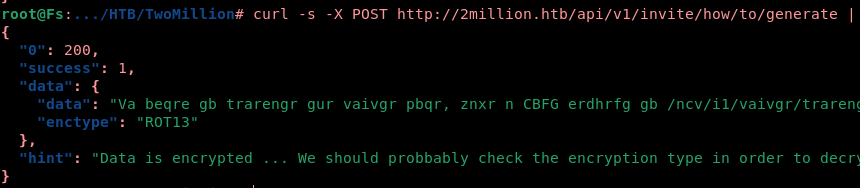
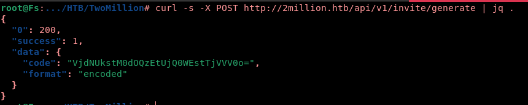
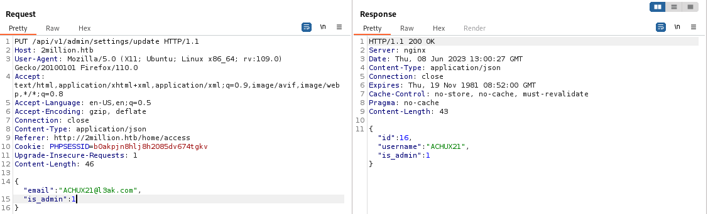

 </br>[](https://git.io/typing-svg)
</br>
<a href="https://app.hackthebox.com/machines/TwoMillion">
  
</a>
</br>
</br>
</br>
## Nmap-scan
</br>

First, let's initiate a quick scan utilizing nmap.


<a href="https://app.hackthebox.com/machines/TwoMillion">
  
</a>
</br>

It appears that we need to include "2million.htb" in our hosts file

```bash
echo "10.10.11.221 2million.htb" >> /etc/hosts
```
</br>

## Trying to have access

Upon visiting the website, I discovered it's an outdated version of the HackTheBox platform. To gain access, I attempted to log in using the default credentials, but unfortunately, I received an error message indicating that the user not found.
<a href="https://app.hackthebox.com/machines/TwoMillion">
  
</a>
</br>
While exploring the website, I discovered that I can join the platform by obtaining an invite code.
</br>

`http://2million.htb/invite`

</br>
I came across a JavaScript code that contains some intriguing elements. 
</br>

`/js/inviteapi.min.js`

<a href="https://app.hackthebox.com/machines/TwoMillion">
  
</a>

</br>
I am interested in generating my own invite code as well.
</br>
I will examine the endpoint "/api/v1/invite/how/to/generate" to gather more information.
</br>


<a href="https://app.hackthebox.com/machines/TwoMillion">
  
</a>
</br>

After decoding the ROT13 cipher, we discovered the method to generate our own invite code.


</br>
<a href="https://app.hackthebox.com/machines/TwoMillion">
  
</a>

Let's proceed with generating our invite code using the discovered method

</br>
<a href="https://app.hackthebox.com/machines/TwoMillion">
  
</a>
</br>
Since the invite is encoded using base64, it should be easy to obtain one.

</br>

```bash
curl -s -X POST http://2million.htb/api/v1/invite/generate | jq .data.code -r |base64 -d
```

## Gain administrative

</br>

Upon logging in with the provided invite code, I have started exploring additional API resources to discover more useful functionalities.


```bash
curl -s http://2million.htb/api/v1 -H "Cookie: PHPSESSID=b0akpjn8hlj8h2085dv674tgkv" |jq .
{
  "v1": {
    "user": {
      "GET": {
        "/api/v1": "Route List",
        "/api/v1/invite/how/to/generate": "Instructions on invite code generation",
        "/api/v1/invite/generate": "Generate invite code",
        "/api/v1/invite/verify": "Verify invite code",
        "/api/v1/user/auth": "Check if user is authenticated",
        "/api/v1/user/vpn/generate": "Generate a new VPN configuration",
        "/api/v1/user/vpn/regenerate": "Regenerate VPN configuration",
        "/api/v1/user/vpn/download": "Download OVPN file"
      },
      "POST": {
        "/api/v1/user/register": "Register a new user",
        "/api/v1/user/login": "Login with existing user"
      }
    },
    "admin": {
      "GET": {
        "/api/v1/admin/auth": "Check if user is admin"
      },
      "POST": {
        "/api/v1/admin/vpn/generate": "Generate VPN for specific user"
      },
      "PUT": {
        "/api/v1/admin/settings/update": "Update user settings"
      }
    }
  }
}

```

</br>

I will attempt to update my settings

</br>

```json
"PUT": {
         "/api/v1/admin/settings/update": "Update user settings"
      }
```

</br>

<a href="https://app.hackthebox.com/machines/TwoMillion">
  
</a>

## Having a RCE


